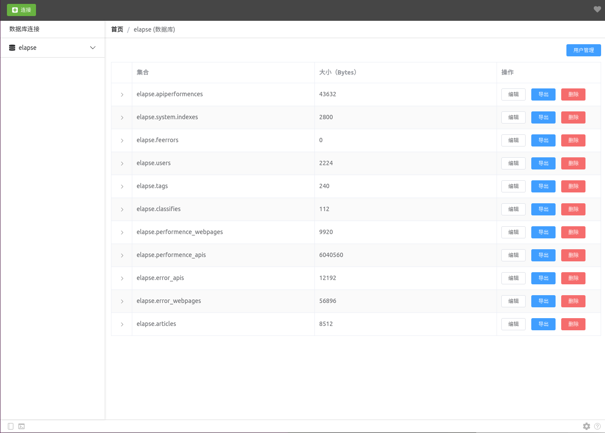
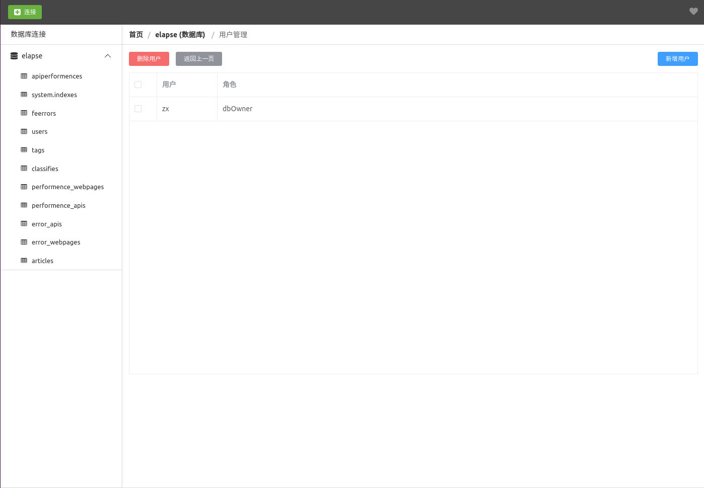
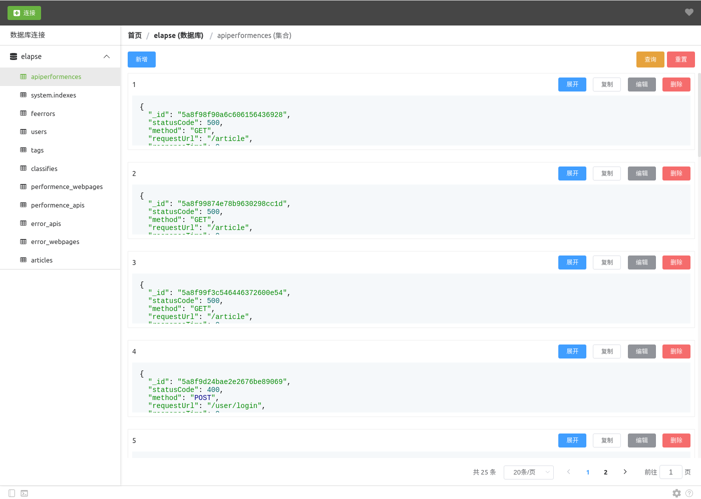

    

<h2 align="center">MongoVisual</h2>

### 使用示例

- 连接数据库

- 数据库统计

- 数据库用户管理

- 集合查询

- 文档查询编辑

### 进度管理
- [x] 数据库连接
- [ ] 数据库索引
- [x] 数据库用户查询
- [x] 数据库用户删除

- [x] 集合状态
- [x] 集合导出
- [x] 集合删除

- [x] 文档查询
- [x] 文档更新
- [x] 文档插入
- [x] 文档删除
