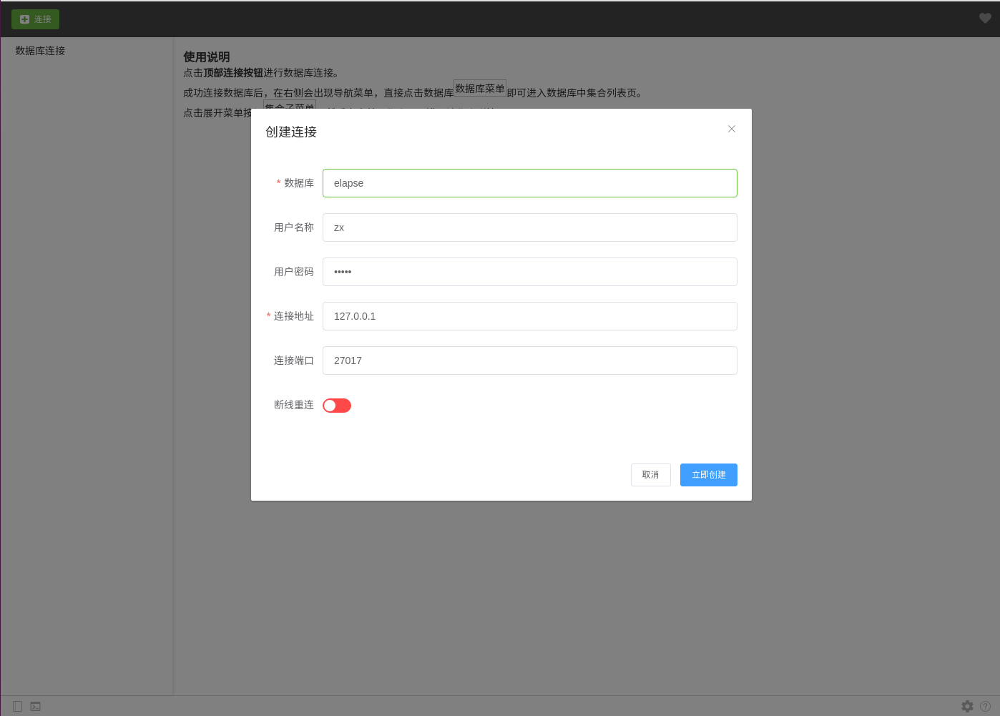
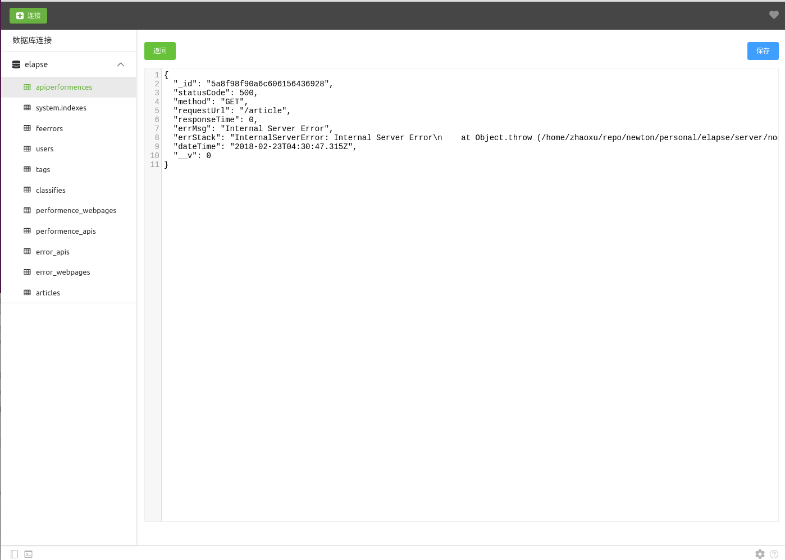

    

<h2 align="center"></h2>
VueMongo是一款跨平台的mongoDB图形化管理应用。界面使用 `electron-vue` 和 `ElementUI` 构建，数据库连接及相关服务由 NodeJs `Koa`
 框架支持。

### 安装使用
1. 拉取代码： `git@github.com:mvpzx/vueMongo.git`
2. 安装依赖： `npm install`
3. 运行应用:  `npm run dev`

> Note: Node.js版本应在8以上，`Koa`服务运行在端口`12345`

### 应用支持
- [x] 数据库连接
- [ ] 数据库索引
- [x] 数据库用户查询
- [x] 数据库用户删除

- [x] 集合状态
- [x] 集合导出
- [x] 集合删除

- [x] 文档查询
- [x] 文档更新
- [x] 文档插入
- [x] 文档删除

### 使用示例

- 连接数据库

- 数据库统计

- 数据库用户管理

- 集合查询

- 文档查询编辑

